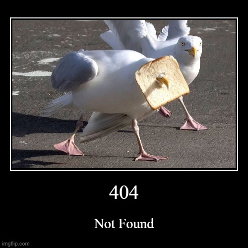

## HTTP Status Birbs
Hypertext Transfer Protocol Response status codes. With cute birbs. Chirp!

### Example

### Misc.
Images used here are not my property and are taken from various sites around the internet.
Please not that the images are NOT used for monetary purposes in any way, shape, or form and copyright infringement is NOT intended.
If you own a particular image and want it to be taken down please open an [issue](https://github.com/thisisjustinm/http-status-birbs/issues) and I will take I down ASAP.
And yes, this is the birb version of [httpstatusdogs](https://httpstatusdogs.com/) and [http.cat](https://http.cat/)